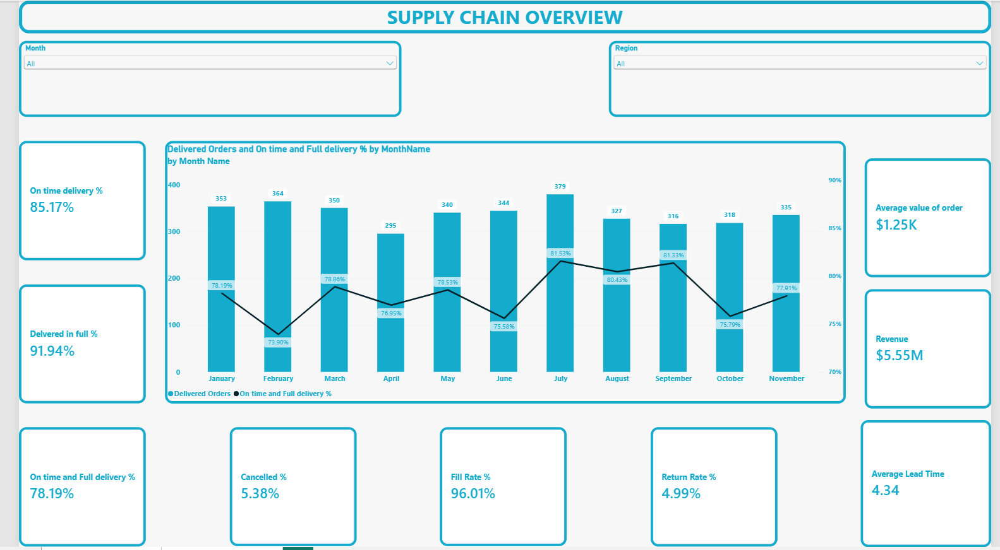
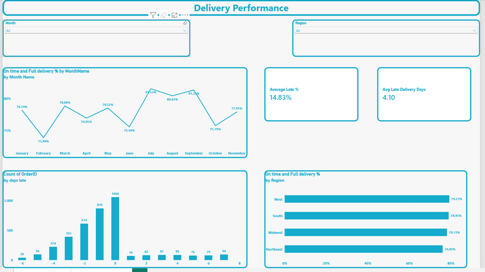

📦 Supply Chain Delivery Performance Dashboard

An interactive Power BI dashboard analyzing order delivery performance, including on-time delivery, in-full delivery, OTIF, fill rate, cancellations, returns, and lead time, across regions and months.

---

## 📌 Project Overview

Delivering orders on time and in full is critical to customer satisfaction and revenue. This project analyzes delivery performance to identify where and when service levels fall short, and gives stakeholders an interactive way to explore the data by **month** and **region**.

## 🎯 Business Questions

- What percentage of orders are delivered on time, in full, and both (OTIF)?
- How does delivery performance change month to month?
- Which regions are underperforming?
- How late are late orders, and how are delays distributed?
- How do cancellations and returns affect performance?

## 📊 Dashboard Pages

### 1. Delivery Overview
High-level KPIs plus monthly delivered orders vs. OTIF %.

### 2. Delivery Performance
Deep dive into OTIF trends, delay distribution, and regional comparison.

## 📈 Key Metrics

| Metric | Value |
|---|---|
| On-Time Delivery % | 85.17% |
| Delivered in Full % | 91.94% |
| On-Time & In-Full (OTIF) % | 78.19% |
| Fill Rate % | 96.01% |
| Cancelled % | 5.38% |
| Return Rate % | 4.99% |
| Average Lead Time | 4.34 days |
| Average Late Delivery Days | 4.10 days |
| Average Order Value | $1.25K |
| Total Revenue | $5.55M |

## 🔍 Key Insights

- **Timeliness is the main gap.** Delivered-in-full is 91.94%, but on-time is 85.17%.
- **Seasonality:** OTIF peaked in July (81.53%) and was lowest in February (73.90%).
- **Regional gap:** Northeast has the lowest OTIF (76.05%), about 3.2 points below West (79.27%).
- **Delay pattern:** Most orders arrive on time or early, but late orders are spread fairly evenly across 1–7 days, suggesting systemic rather than isolated causes.
- **Strong fill rate (96.01%)** indicates inventory availability is not the main problem.

## 💡 Recommendations

1. Review Northeast carriers, routes, and warehouse processes.
2. Analyze July's operations and replicate best practices in weaker months.
3. Build early-warning alerts for orders at risk of late delivery.
4. Investigate the causes of cancellations and returns (~5% each).

## 🛠️ Tools & Technologies

- **Power BI Desktop**: dashboard design and visualization
- **DAX**: KPI and measure calculations
- **Power Query**: data cleaning and transformation
